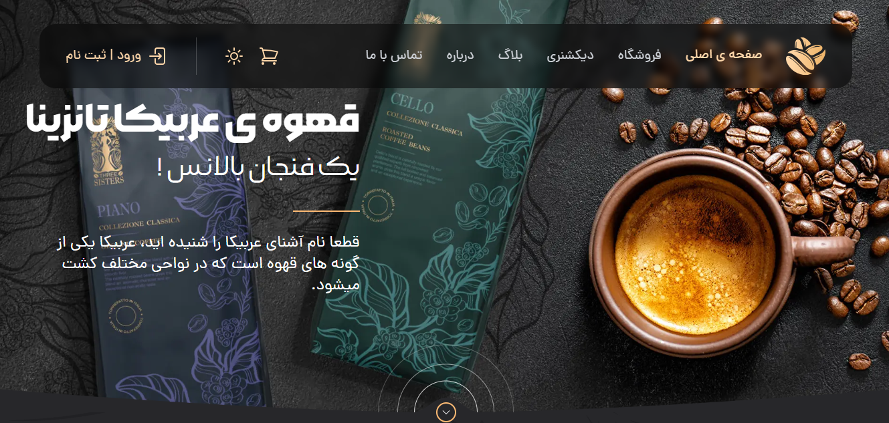

# ☕ Coffee Shop – Single Page E-commerce

A beautiful, responsive single-page coffee shop website with **dark/light mode**, working shopping cart, and clean modern design — built as an early web development project.

## ✨ Features

- **Single Page Application** (SPA-like experience)
- **Dark Mode / Light Mode** toggle (persists in localStorage)
- **Fully responsive** design — looks great on mobile, tablet & desktop
- **Working Shopping Cart**:
  - Add / Remove items
  - Update quantity
  - Real-time total price calculation
- Clean product grid with discounts & availability status
- Attractive hero section + product showcase
- Simple & cozy coffee shop vibe

## 🖥️ Screenshots

### Hero & Main View (Light Mode)

<!-- You can replace this with your own screenshot later -->
<!-- For now using a placeholder coffee hero style that matches the vibe -->

### Product Grid & Cart (Dark Mode)

(Pro tip: Take your own screenshots of the live demo in both modes and upload them to the repo as `screenshot-light.png` and `screenshot-dark.png` — then update the links like this: ``)

## 🛠️ Technologies Used

- **HTML5** – Semantic & accessible structure
- **CSS3** – Custom styles + advanced layouts
- **Tailwind CSS** – Utility-first framework (v3+)
- **Vanilla JavaScript** – DOM manipulation, cart logic, theme switcher

No frameworks, no build tools — pure front-end learning project 🚀

## 🚀 Live Demo

🌐 https://ashrafi-frontdeveloper.github.io/Coffee-Shop/

Feel free to explore the products, switch themes, add items to cart and see the total update in real time!
